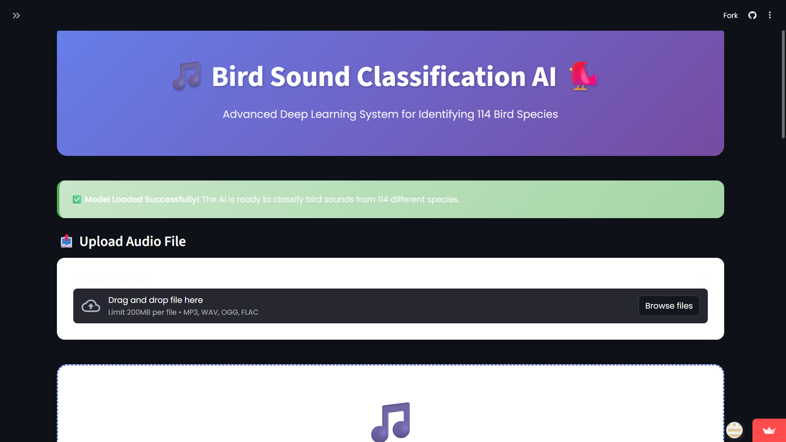
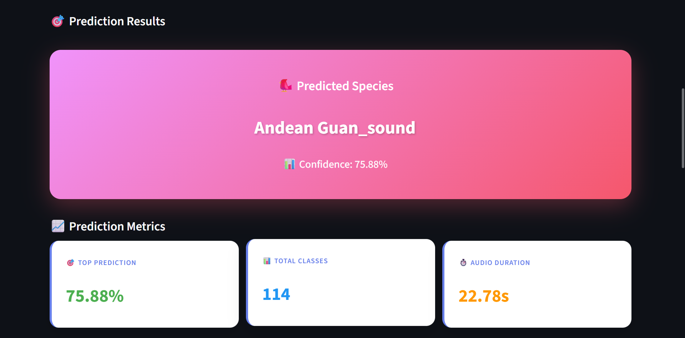
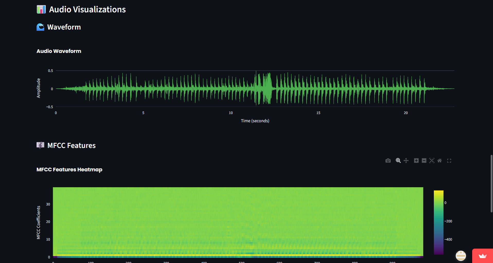

# 🎵 KooKoo AI - Bird Species Classification 🐦

A deep learning-powered web application for classifying bird species from audio recordings using Convolutional Neural Networks (CNN) and MFCC features.


## ✨ Features

- 🎵 **Professional UI/UX**: Modern gradient design with smooth animations
- 🎨 **Responsive Layout**: Works perfectly on desktop, tablet, and mobile
- 🎯 **Real-time Prediction**: Classify bird species with confidence scores
- 📊 **Top 5 Predictions**: View the most likely bird species
- 🌊 **Interactive Visualizations**: 
  - Audio waveform display with Plotly
  - MFCC features heatmap
  - Top predictions bar chart
- 📈 **Detailed Analytics**: View model performance metrics
- 💾 **Export Results**: Download predictions as CSV
- 🚀 **Fast Inference**: Optimized model for quick predictions
- 🎨 **Custom Theming**: Beautiful purple-blue gradient theme
- 📱 **Mobile Friendly**: Fully responsive design

## 🛠️ Installation

### Prerequisites

- Python 3.8 or higher
- pip package manager

### Step 1: Clone the Repository

```bash
git clone https://github.com/tarun-02005/koo-koo-ai-new.git
cd koo-koo-ai-new
```

### Step 2: Create Virtual Environment (Recommended)

```bash
# Windows
python -m venv venv
venv\Scripts\activate

# macOS/Linux
python3 -m venv venv
source venv/bin/activate
```

### Step 3: Install Dependencies

```bash
pip install -r requirements.txt
```

### Step 4: Download Model Files

Ensure you have the following files in the project directory:
- `model.h5` - Trained CNN model
- `prediction.json` - Label mapping dictionary

## 🚀 Usage

### Running Locally

```bash
# Option 1: Using Python module
python -m streamlit run app.py

# Option 2: Direct command (if streamlit is in PATH)
streamlit run app.py
```

The application will open in your default browser at `http://localhost:8501`

### Using the Application

1. **📤 Upload Audio File**: 
   - Click on the file uploader 
   - Select a bird sound audio file (MP3, WAV, OGG, FLAC)
   - Preview the audio in the built-in player

2. **🎧 Preview & Options**: 
   - Listen to your audio file
   - Toggle visualization options (Waveform, MFCC, Top 5)

3. **🎯 Classify**: 
   - Click the "Classify Bird Species" button
   - Wait for AI processing (2-5 seconds)

4. **📊 View Results**: 
   - See predicted species with confidence score
   - Explore top 5 predictions
   - Analyze interactive visualizations
   - Read MFCC feature explanations

5. **💾 Download**: 
   - Export the top 5 predictions as CSV
   - Save results for documentation

## 🌐 Live Demo

**🚀 Try it now**: [https://koo-koo-ai.streamlit.app/](https://koo-koo-ai.streamlit.app/)

**Local Demo**:
```bash
# Quick start
python -m streamlit run app.py
```

## 🧠 Model Architecture

### Optimized CNN Model

```
Input Shape: (40, 1) - 40 MFCC coefficients

Block 1: Feature Extraction
├── Conv1D(128 filters, kernel=3, ReLU)
├── BatchNormalization
├── Conv1D(128 filters, kernel=3, ReLU)
├── BatchNormalization
├── MaxPooling1D(pool_size=2)
└── Dropout(0.2)

Block 2: Deeper Feature Learning
├── Conv1D(256 filters, kernel=3, ReLU)
├── BatchNormalization
├── Conv1D(256 filters, kernel=3, ReLU)
├── BatchNormalization
├── MaxPooling1D(pool_size=2)
└── Dropout(0.3)

Block 3: High-Level Features
├── Conv1D(512 filters, kernel=3, ReLU)
├── BatchNormalization
├── MaxPooling1D(pool_size=2)
└── Dropout(0.3)

Fully Connected Layers
├── Flatten
├── Dense(512, ReLU, L2 regularization)
├── BatchNormalization
├── Dropout(0.5)
├── Dense(256, ReLU, L2 regularization)
├── BatchNormalization
├── Dropout(0.4)
└── Dense(114, Softmax)

Output: 114 bird species classes
```

### Training Details

- **Optimizer**: Adam (learning_rate=1e-3)
- **Loss Function**: Sparse Categorical Crossentropy
- **Metrics**: Accuracy
- **Callbacks**: EarlyStopping, ReduceLROnPlateau, ModelCheckpoint
- **Regularization**: Dropout + L2 + Batch Normalization

## 📊 Dataset

- **Source**: Kaggle - Sound of 114 Species of Birds Till 2022
- **Classes**: 114 different bird species
- **Format**: MP3 audio files
- **Features**: MFCC (40 coefficients extracted at 22050 Hz)

## 📸 Screenshots

### Main Interface


### Prediction Results


### Visualizations


## 🛠️ Technologies Used

- **Frontend**: Streamlit
- **Backend**: Python
- **Deep Learning**: TensorFlow/Keras
- **Audio Processing**: Librosa
- **Visualization**: Plotly
- **Data Processing**: NumPy, Pandas

## 📁 Project Structure

```
koo-koo-ai-new/
│
├── app.py                          # Main Streamlit application
├── model.h5                        # Trained CNN model
├── prediction.json                 # Label mapping dictionary
├── requirements.txt                # Python dependencies
├── README.md                       # Project documentation
├── .gitignore                      # Git ignore file
│
└── screenshots/                    # Application screenshots (to be added)
    ├── main_interface.png
    ├── prediction_results.png
    └── visualizations.png
```

## 🤝 Contributing

Contributions are welcome! Please follow these steps:

1. Fork the repository
2. Create a new branch (`git checkout -b feature/AmazingFeature`)
3. Commit your changes (`git commit -m 'Add some AmazingFeature'`)
4. Push to the branch (`git push origin feature/AmazingFeature`)
5. Open a Pull Request

## ‍💻 Authors

- **Tarun Kumar** - [GitHub](https://github.com/tarun-02005) | [LinkedIn](https://www.linkedin.com/in/tarun-kumar-359150257/)

## 🙏 Acknowledgments

- Dataset from Kaggle: Sound of 114 Species of Birds Till 2022
- TensorFlow and Keras teams for the deep learning framework
- Streamlit team for the amazing web framework
- Librosa developers for audio processing tools

## 📞 Contact

For any questions or feedback, please reach out:

- Email: tarun2005bansal@gmail.com
- GitHub: [@tarun-02005](https://github.com/tarun-02005)
- LinkedIn: [Tarun Kumar](https://www.linkedin.com/in/tarun-kumar-359150257/)

## 🔮 Future Improvements

- [ ] Add real-time audio recording feature
- [ ] Implement data augmentation for better accuracy
- [ ] Add support for more bird species
- [ ] Include geographical information about bird species
- [ ] Add multi-language support
- [ ] Implement batch prediction for multiple files
- [ ] Add model confidence threshold settings
- [ ] Include bird species information and images

---

**⭐ If you find this project helpful, please consider giving it a star!**

Made with ❤️ and 🐦
